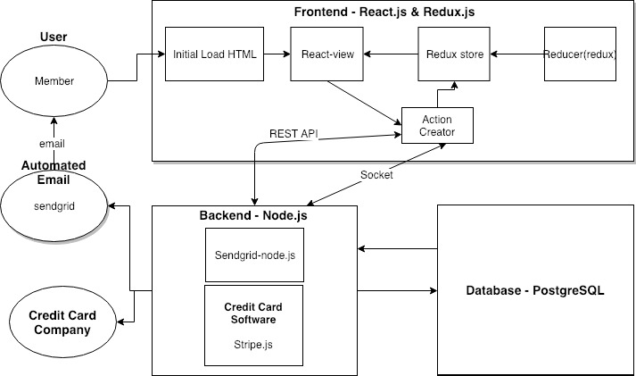

<h1><b>What is Members Only?</b></h1>

*Members Only* is a social media site where users, known as Members, can post statuses, photos, links, and everything else that one may post on another social media outlet. So what makes *Members Only* different you may ask? Exclusivity. Not just anyone can join *Members Only*. You must receive an invitation from another Member or be lucky enough to receive an entrance code from one of our Idols. This makes *Members Only* a gated community, where we can house exactly the people that we want to be on the site. This is formulated and handpicked data, which can, and will, be used for a multitude of profitable purposes. 

# The Pillars of *Members Only*

## Members

Members are our users. They are the the traffic, the data, and most importantly: the revenue. Members are able to access the site via a Login page bringing them to their feed, where by default they are connected with every other Member on the site. This allows them to see the statuses, photos, and any other form of output from every other Member they follow. Otherwise, Members have the option to privatize their profile - allowing them to be seen only by their followers (other Members whom either invited this Member or were invited by this Member). Most importantly, what do Members bring? The simple answer is: data. And heaps of it. Our plan is to store all of Members posts, comments, photos, filtered photos, time spen on certain areas of the site, which statuses and links draw their attention, and everything else imaginable. All of this knowledge allows us to carefully curate advertisements for each individual user, drawing the most revenue to the site. And for all their actions on the site, we reward Members with points. A simple mechanism that will keep Members wanting to keep coming back to the site. They post a photo and filter it? Have some points. They post a status that receives lots of comments? Have some more points. A Member successfully gets a New Member to join the *Members Only*? Have even **more** points! And with these points, Members can choose to use them to invite New Members to the site, expanding their circle of friends within our gated community. This allows Members to create subcommunities within the overarching *Members Only* social media website, which will keep Members excited for more. Without Members, *Members Only* doesn't exist. 

## Idols

Idols are our bedrock from which we build the site and draw in New Members. Idols are paid and are *enhanced* Members. Enhanced meaning they have all the functionality of a normal Member, but with the addition of unlimited points and invitation codes, which are used to send invitations to potential New Members: namely, their fanbase. In this sense, Idols are the first step to attracting large pools of Members to join *Members Only* and build up it's user base. Once on the site, Members will see all of their Idol's updates, effectively joining the community of the Idols. 

## Administrators

Administrators are our next *enhanced* Member. First and foremost, we have admininstrators to keep the peace. They will manually review any flagged content to confirm that no illicit content stays on the pages of *Members Only*. Although *Members Only* is a gated community, our goal is not to establish a reputation for allowing unlawful material on our site. Furthermore, Administrators will solve disputes between Members, effectively making sure that our Members are happy during their time spent on our site. Administrators will have the ability to insert sponsored content and filters into other Members photos as to please the advertisers who pay *us*. Additionally, they will be able to add links, comments, and other materials into Members posts for advertising and any other purposes deemed necessary around *Members Only*. And notably, the original poster will **not** be able to see the changes made to their posts, but all other Members will see the change immediately. 

# User Stories

## ***New Members***
 
### 1. New Member Signs Up For *Members Only* From Invitation Link
Josh receives a link from a friend to join *Members Only*. Naturally, Josh is very excited and is eager to join the site. Josh finds the link in an email from *Members Only* and selects it. He is now brought to a *Members Only* webpage that asks him to confirm that he wants to join *Members Only*. Josh selects the "Yes" button, confirming he wants to join *Members Only*. Upon accepting, he is brought to a Sign Up webpage. The page consists ofa form, with required fields of: First Name, Last Name, Street Address, City/Town, Zip Code, Country (U.S. only), Email Address, and a Password. Josh will then select a checkbox confirming that he accepts the Terms and Conditions of *Members Only*. Finally, Josh will select the "Submit" button, and he is sent a confirmation email to confirm his sign up at *Members Only*. Josh will need to go to this email and select the account confirmation link, finalizing the creation of his account and bringing him to his own *Members Only* account webpage. In order to continue use of *Members Only*, Josh will need to enter his credit card details and confirm a charge. 
 - Non-Functional Aspects:
   - Web Server receives form submission
   - Web Server sends to Node.js backend
   - Node.js backend sends automated email
   - Member's data get sends to database through interface calls

### 2. New Member Signs Up For *Members Only* From Invitation Code
Brianna manages to get her hands on an invitation code to *Members Only* from one of her favorite Idols. To use this, Brianna navigates to the *Members Only* site and is brought to the Login page. Brianna will select "Sign Up With Invitation Code". Upon selecting this, Brianna is brought to a new webpage where she is asked to enter her code. Brianna will enter the code correctly and then select a "Submit" button. Afterwards, she will be brought through the same account creation process as described previously. 
 - Non-Functional Aspects:
   - Web Server receives form submission
   - Web Server sends to Node.js backend
   - Node.js backend sends automated email
   - Member's data get sends to database through interface calls

### 3. New Member's Invitation Link Expires
Liam receives an invitation link to *Members Only*. However, he is very busy and forgets to about it for more than 4 days. Because of this, the email link will expire, and he will lose this opportunity to join the site. To be able to join again he will have to be sent another invitation link. 
 - Non-Functional Aspects:
   - Node.js backend keeps track of how long unnaccepted invitation has been sent out
   - Node.js backend terminates validity of invitation instance

### 4. New Member Confirms Credit Card Details
Upon successful creation of her account, Catherine will need to enter her credit card details in order to confirm her identity. Upon successful account creation, Catherine receives an email to confirm her payment details. Catherine will select this link, bringing her to a form on the *Members Only* website. The form has required fields of a valid 16-digit credit card number, her full name, expiration date, and 3-digit CVV. Catherine will then select "Submit". Once approved, she will be brought to her *Members Only* account page.
 - Non-Functional Aspects:
   - Web Server receives form submission
   - Web Server sends to Node.js backend
   - Member's data get sends to database through interface calls

### 5. New Member Confirms Credit Card Charge
After Catherine successfully confirms her credit card information, she will be charged a random amount between $0.20 and $0.45 that she will need to confirm on the *Members Only*. Catherine will receive an email shortly after submitting her credit details, notifying her that her credit card has been charged for the first time. Catherine will need to confirm the amount charged by *Members Only*. After confirming the charge, Catherine will navigate to the notification email from *Members Only*. Catherine will select the hyperlink in the email, bringing her to a form with an entry field for the value of the charge. Catherine will then enter the correct charge amount and select "Submit". Upon submitting the correct amount, she is brought back to her *Members Only* page as a verified Member. Otherwise, she will be asked to resubmit the correct amount she was charged, and will be locked out after 3 failed attempts.
 - Non-Functional Aspects:
   - Node.js backend sends automated credit card charge using Stripe.js
   - Web Server receives charge amount input
   - Node.js receives input and validates it is the same as amount charged

## ***Members***

### 6. Member Logs in to *Members Only*
Johnson wants to log into *Members Only* and check his feed. To do this, Johnson will navigate to the *Members Only* homepage, which includes a login for existing users form. Johnson will enter his email address and correct password associated with his *Members Only* account. Johnson will then select "Login". If the correct email/password combination are entered, he will then be redirected to his *Members Only* feed. 
- Non-functional Aspects:
   - Web Server receives form submission
   - Node.js backend receives login request and validates credentials

### 7. Member Updates Credit Card Information
Alex must be logged into *Members Only*. From the homepage, he will select "Settings" and be redirected to a *Members Only* webpage. He will then select "Change Payment Details". Alex will now need to confirm his new credit card details [SEE #4]. He will also need to confirm a credit charge [SEE #5].
 - Non-Functional Aspects:
   - Web Server receives form submission
   - Web Server sends to Node.js backend
   - Node.js backend accesses database through interface calls to update information associated with particular Member

### 8. Member Confirms Tri-Monthly Credit Card Charge
Every 3 months, Alex will receive a random credit card charge between the amounts $0.20 and $0.45. He will receive an automated email at specified time period asking him to validate the charge made to his account. He will then select the link within the email. For confirming a credit card charge [SEE # 5]. This must be done within 4 days of receiving the original email. If done correctly, Alex will be able to continue using *Members Only* until his next Tri-Monthly charge.
- Non-Functional Aspects:
   - Node.js backend sends automated credit card charge using Stripe.js
   - Web Server receives charge amount input
   - Node.js receives input and validates it is the same as amount charged

### 9. Member Fails to Confirm Tri-Monthly Charge Before Expiration
Alex does not enter the correct charge amount before expiration (4 days), and is blocked from using *Members Only*. When Alex tries to access *Members Only*, they are directed to a page asking to send an additional charge. Alex selects "Confirm" button. Alex's credit card is charged a random amount between $0.20 and $0.45. Alex receives another email and selects the link within the email. They are redirected to *Member's Only* where they enter the correct charge amount. Alex's use of *Members Only* is restored.
- Non-Functional Aspects:
   - Node.js backend sends automated credit card charge using Stripe.js
   - Web Server receives charge amount input
   - Node.js receives input and validates it is the same as amount charged

### 10. Member Posts a Status Update on Personal Profile
Alex will select an option on their profile page that reads "Create New Post". He will then be met with a textbox popup where he may enter text and/or hyperlinks. If entering a hyperlink, Alex will select the "URL Shortener" button, where he will proceed to enter the full URL. Once finished editing his status update, Alex will select "Post". The URL will appear in shortened form upon posting his status update.

- Non-Functional Aspects:
   - Web Server receives new post
   - Node.js backend receives post information and posts it
   - Node.js backend uses database interface to update post table with new post 

### 11. Member Leaves Comment on Other Member's Status
Alex sees their friend’s status on their profile feed. Alex will select the "Comment" button that appears on the bottom of their friend’s post. Alex will be met with a textbox popup, in which he will type his comment. Once finished, he will select the "Post" button. 
- Non-functional Aspects:
   - Web Server receives new post
   - Node.js backend receives comment information and posts it
   - Node.js backend uses database interface to update comment table with new post 

### 12. Member Invites a Potential New Member to *Members Only*
Alex navigates to the “Invite New Member” button on the *Members Only* homepage to invite his friend Marisa. He will be redirected to a new webpage with a form, with required fields of potential New Member's valid email address, name, and optional dropdown menu of "How You Know This Person". He will then fill in the required fields with Marisa's details, and select "Submit". 1000 points are removed from Alex's account. 
   
#### 12a. Potential New Member Accepts Invitation
Marisa receives an email from *Members Only* to join. She selects the hyperlink in the email, and is brought to a webpage asking to confirm joing *Members Only*. She selects "Yes". For signup details [SEE #1]. Alex receives 50 points. 
#### 12b. Potential New Member Lets Invitation Link Expire
Marisa receives an email from *Members Only* to join. She does not see the email, or does not want to join *Members Only*. After 4 days, the link expires. Alex loses an additional 100 points. 
- Non-functional Aspects
   - Web Server receives request to send a new invitation link
   - Node.js backend processes request and sends an automated email with link
   - Node.js backend keeps track of how long invitation has been out for

### 13. Member Posts Photo to Profile
From their profile page, Alex selects "Post Photo". Alex is met with a popup window, where he navigates to the photo he wishes to post. He confirms the photo, and is able to enter additional text to the post within a textbox. Once complete, Alex selects "Post".
- Non-functional Aspects:
   - Web Server receives new post and photo
   - Node.js backend receives post information and posts it
   - Node.js backend uses database interface to update post table with new post
   - Node.js backend uses database interface to update photo table with new photo

### 14. Member Edits Photo Before Posting
Alex will go through the "Member Posts Photo to Profile" process [SEE # 13], but immediately after choosing his photo he will instead select "Filter Photo". Alex will now be able to scroll through various premade filters available on *Members Only*. Alex will choose a filter that will be applied to their photo, and continue the photo posting process.
- Non-functional Aspects:
   - Web Server receives new post and photo
   - Node.js backend receives post information and posts it
   - Node.js backend uses database interface to update post table with new post 
   - Node.js backend uses database interface to update photo table with new photo
   - Node.js backend uses database interface to update filtered photo table with new photo

### 15. Member Removes Photo Filter
Alex navigates to his profile page and selects the photo he wishes to remove the filter on. Alex selects “Photo Options”. Alex then selects "Remove Filter". The filter is then removed from the photo. Alex is then prompted to confirm their changes. Alex will select "Confirm".
- Non-functional Aspects:
   - Web Server receives new post and photo
   - Node.js backend receives post information and posts it
   - Node.js backend uses database interface to update post table with new post 
   - Node.js backend uses database interface to update photo table with new photo
   - Node.js backend uses database interface to update filtered photo table with new photo

### 16. Member Adds Sponsored Content to Photo
Alex will go through the "Member Posts Photo to Profile" process [SEE # 13], but immediately after choosing his photo he will instead select "Add Sponsored Content". Alex will have the choice of the items currently available on *Members Only*, and can drag and drop them onto his photo. Once finished, Alex will confirm changes by clicking "Confirm". 
- Non-functional Aspects:
   - Web Server receives new post and photo
   - Node.js backend receives post information and posts it
   - Node.js backend uses database interface to update post table with new post 
   - Node.js backend uses database interface to update photo table with new photo
   - Node.js backend uses database interface to update filtered photo table with new photo
   
### 17. Member Flags Photo As Inappropriate/Illegal
Alex is browsing *Members Only* and comes across a photo they believe to be inappropriate
and/or illegal. Alex proceeds to select the “Report” button under said photo. They are then
prompted with a textbox asking for comments on reasoning for reporting the photo. Alex enters
details on why they believe the content to be inappropriate and/or illegal. Alex proceeds to
select the “Confirm” button under the textbox. After selecting confirm, Alex is returned to the
homepage of *Members Only*. 
After hitting confirm, the web server receives the report. The web server sends the report to
backend services. Backend services will process the report, and send to Administrators for
further action.
- Non-functional Aspects:
   - Web Server receives report that photo was flagged for illicit content
   - Node.js backend receives report from Web Server
   - Node.js backend sends report and photo to Admins for further action

### 18. Member Forgets Password/Inputs Invalid Password
Johnson wants to log into *Members Only*, but has forgotten his password. He will select the button "Forgot Password". This will redirect him to a different form on the *Members Only* website where he will fill enter the required fields of his email address and full name. Johnson will then be sent an email with a link to reset his password. Johnson will select the link, and be redirected to a *Members Only* webpage. He will be required to enter a new password in one textbox, and confirm his password in a second textbox. He will then select "Submit". If the passwords match, Johnson's password is successfully changed and he is redirected to a webpage confirming successful password change. 
- Non-functional Aspects:
   - Web Server receives form submission
   - Node.js backend receives login request and rejects credentials

### 19. Member Forgets Email/Inputs Invalid Email
Johnson directs himself to the *Members Only* homepage and tries to log into his account. However, Johnson has forgotten the email address associated with his account. Johnson will select "Forgot Email" and be redirected to a form where he must enter his full name and address. After filling in these details, he will select "Submit". If the name and address match a Member at *Members Only*, Johnson will be redirected to a webpage providing his email associated with *Members Only*. 
- Non-functional Aspects:
   - Web Server receives form submission
   - Node.js backend receives login request and rejects credentials

### 20. Member Changes Password
Larry wants to change his password, for security reasons. Larry will select "Settings" from any *Members Only* webpage. Larry will then select "Change Password". Larry will be brought to a separate page where he will be prompted to enter his current password, new password, and confirmation of new password. Larry will then select "Confirm" and the system will verify that the new passwords are identical and current password is correct. If everything is correct, Larry will be redirected back to his *Members Only* feed confirming change of password. If new passwords do not match, he will be met with an error and need to resubmit.  
- Non-functional Aspects:
   - Web Server receives form submission
   - Node.js backend receives new password
   - Node.js uses database interface to update values associated with Member

### 21. Member Changes Visibility Settings 
Danny wants to hide his activity from non-followers on *Members Only*. To do this, Danny will select the "Settings" buttom from any *Members Only* webpage. From here, he will select "Visibility" where he will find a toggle button. He will select the button, changing his profile from "Non-Private" to "Private".privatized profile. This will hide his activity from non-followers.
- Non-functional Aspects:
   - Web Server receives change of privacy request
   - Node.js backend receives request
   - Node.js uses database interface to update values associated with Member
   
### 22. Member Unfollows Another Member
Alex has decided he no longer wants to see Brian's updates on *Members Only* because his posts are annoying. Thankfully, Alex did not invite Brian so he can do this. Alex navigates to Brian's profile page where they select the "Unfollow" button on Brian's page. Alex is then met with a confirmation popup, "Are you sure you want to unfollow **Brian**?". They confirm their choice to unfollow Brian by selecting the "Yes" button. Alex is then redirected to the *Members Only* homepage. Alex can no longer see any of Brian's updates - which he is very happy about. 
- Non-functional Aspects:
   - Web Server receives unfollow request
   - Node.js backend is handed unfollow request from Web Server
   - Node.js disassociates these two Members from one another, hiding their separate activities from each other

### 23. Member Blocks Another Member
Jessica has just broken with Alex, and Alex has been sending threatening messages to Jessica. He won't leave her alone on *Members Only*. She has decided that it's in her best interest to block Alex. Jessica navigates to Alex's profile page on *Members Only*. She selects the "Block" button on Alex's page, where she is met with a confirmation popup with an optional "Reason For Blocking" textbox. Jessica decides to give the details of her experience in this textbox. She then confirms "Are you sure you want to block **Alex**? **This action cannot be undone.**" Jessica selects the "Yes" confirmation button. She is returned to the *Members Only* homepage, and all communication between Jessica and Alex is blocked.
- Non-functional Aspects:
   - Web Server receives block request
   - Node.js backend receives block request
   - Node.js uses blocks data communication between these two Members

### 24. Member Reports Another Member
Phil wants to report another Member on *Members Only* for an offensive action. Phil will navigate to the perpetrator's *Members Only* profile page. He will then select "Report Member". Phil will be redirected to a webpage with a textbox where Phil will enter the details of his report. Phil will then select "Submit". The details of the report will be forwarded to the Administrators of *Members Only* for further review.
- Non-functional Aspects:
   - Web Server receives block request
   - Node.js backend receives block request
   - Node.js uses blocks data communication between these two Members
   - Node.js sends report to Admins

## ***Admin***

### 25. Administrator Removes Member's Access to *Members Only*
Administrator Ava is working through checking the flagged content on the *Members Only* and she encounters the profile of Jonas (a Member) who was flagged for posting inappropriate content.  Ava directs herself to view Jonas’s profile. From there, she may review all the flagged content on his profile and come to a conclusion on whether or not Jonas should be removed or not from *Members Only*.  Ava concludes that Jonas must be removed for violating the site’s posting policy. She selects the “Remove Member” button via the Jonas' profile page, with a confirmation window pop-up. She selects "Confirm. Jonas is removed from *Members Only* and his content is no longer viewable. Jonas receives an email notifying him of this action.
- Non-functional Aspects:
   - Web Server receives removal request
   - Node.js backend receives removal request
   - Node.js disallows Member's credentials to be used to login

### 26. Administrator Removes Content Flagged as Inappropriate/Illegal
Administrator Ava is working through checking the flagged content on *Members Only* and receives a report of inappropriate content in the form of a flagged photo. Ava directs herself to review the flagged photo, and she must come to a conclusion on whether the photo should be removed or not. She deems the content inappropriate/illegal, and proceeds to remove the photo. She selects the “Remove Post/Photo” button on the webpage of the photo, causing a confirmation popup to occur. She selects "Confirm", and the content is removed from *Members Only*.
- Non-functional Aspects:
   - Web Server receives removal request
   - Node.js backend receives removal request
   - Node.js uses database interface to remove data from the site

### 27. Administrator Edits Member's Photo
Administrator Andrew wants to make *Members Only* more visually pleasing. He decides he wants to edit a member’s photo to add a filter in the hopes that it would increase web traffic to the site. First, Andrew directs himself to the webpage containing the photo he wants to edit, on Member Curtis' page. He proceeds to edit the photo [SEE #14-16]. After making the necessary revisions, he selects the "Confirm" button, altering the photo. Curtis will not see the changed content on his own profile but rather what he originally posted - while all other Members of *Members Only* will see the altered photo.
- Non-functional Aspects:
   - Web Server receives new post and photo
   - Node.js backend receives post information and posts it
   - Node.js backend uses database interface to update post table with new post 
   - Node.js backend uses database interface to update photo table with new photo
   - Node.js backend uses database interface to update filtered photo table with new photo

## ***Idol***

### 28. Idol Has All Privileges of a Member
Tony loves using *Members Only*, and as a popular social media figure, he has the designation as an Idol. Due to this, he has all the privileges of a Member [SEE# 6-24].  Addtionally, he has access to unlimited invitations and unlimited invitation codes. Notably, he also has unlimited *Members Only* points.

### 29. Idol Invites a New Member
Tony, an Idol, wants to contribute to the web sites overall Member base count by inviting new members to the site.  He does this to increase the web traffic to *Members Only* and increase his own revenue. As a Member, he may send an invitation via email [SEE# 12]. The alternate mode of invitation is via invitation code. Tony may receive invitation codes by selecting "Invitation Code Generation", which will generate a new random invitation code that is valid for 30 days.
- Non-functional Aspects
   - Web Server receives request to send a new invitation link
   - Node.js backend processes request and sends an automated email with link
   - Node.js backend keeps track of how long invitation has been out for

### 30. Idol Visibility
Idols are the **faces** of *Members Only*, and as such need to be highly visible. Thus, Idols do not have a visibility toggle option like Members. We want it to be the case that all Members should be allowed to see their profiles.

## ***System***

### The system deducts a point to the member  
The backend receives a request containing the user information from the frontend. The server finds the matched member data in the database and takes a point off. Then the system sends updated point information to the frontend. The frontend updates the point information in a local storage ,and Alex will recoginize the changes.

### 31. System Deducts Points From Member  
Alex, a Member, invites a potential New Member (or invitation failed, etc.). The backend receives request, and the database finds the matched Member information in database and updates the matched member's information. The system sends updated point information to the frontend. The system updates the point information in local storage and Alex will see the changes immediately. 

### 32. System Awards Points To Member  
Alex's invitation is accepted or he makes positive actions (posts photo, comment). The backend receives request. The database finds the matched Member information in database and updates the matched member's information. The system sends updated point information to the frontend. The system updates the point information in local storage and Alex will see the changes immediately. 

### 33. System Receives Login Request From Frontend 
Frontend sends a Login request to a backend. The backend receives a request that contains user information. The backend stores a Member's current IP address into the database. Backend confirms whether the information given is matched with user data in database. The backend sends tokens and matched user information to the frontend. 

### 34. System Receives Logout Request From Frontend   
Alex selects the "Logout" button from frontend. Frontend detects when the “Logout” button is selected. The frontend sends Alex’s sign out time to backend. Backend stores Alex's logout time. Frontend removes the session data in local storage. The frontend redirects Alex to a landing page. 

### 35. System Receives Registration Request From Frontend 
A potential New Member (Bob) fills out a registration form and selects the "Register" button. The backend receives a request that contains potential New Member’s information. If the credit card information already exists, the backend sends an error to the frontend  and Bob must fix the error. If the credit card information does not exist in the database, The system checks that the given credit card information is valid using credit card software. If the data is valid, the system stores New Member user information into the database. The frontend redirects Bob to a Login page. If the data is **not** valid, the backend sends an error to the frontend and Bob must fix the error. 

### 36. System Retains Member's Actions (Interests)
Alex, a Member, performs specific expected actions. The frontend detects an item being selected when a Member selects a specific post or other content on the current screen (if a Member stays longer at a specific page of *Members Only*). The frontend sends this information to the backend. The backend receives the data and stores it in the database.

### 37. System Converts URL to Shortened URL 
The frontend sends the request to a backend. Frontend sends a request to the backend with original URL information. The backend receives the request and uses a hash function to generate a shortened URL. The System saves the shortened URL into the database. The System sends the shortened URL to the frontend. In the case of the system cannot perform shortening, it will use the original URL. 

<h1><b>Non-Functional Requirements</b></h1>

### FrontEnd 
***React.js***   
- React is very a simple and lightweight library that only deals with the view layer. It is not a beast like other MV* frameworks such as Angular or Ember. Since, one team is going to take care of the frontend, it's good for them to only focus on view layer using React.js 

- React provides a component based structure. As a result:
    - your app has consistent look and feel.
    - code re-use makes it easier to maintain and grow your codebase.
    - it is easier to develop your app.

- Updating DOM is usually the bottleneck when it comes to the web performance. React efficiently compares the previous and current states of the virtual DOM and calculates the best way (minimum amount of updates needed) to apply these changes. This is the main reason behind React’s high performance.

### Backend 
***Node.js***

- Since we already decided to use JavaScript(React.js) for frontend, it’s a no-brainer to pick Node.js(Javascript).

- Node.js use V8 engines by Google. Fast and scalable web apps in a result.

- Thanks to this popularity, a vicious cycle is set up: your favorite API might only offer an official Node.js library, and other languages are not even considered, left for unofficial packages 

### Credit Card Software 
***Stripe.js*** 
- In keeping with their principle of simplicity and convenience, pricing is 2.9% + $.30 per successful transaction.

-  There are extremely readable documentations and code samples to do efficient custom integration. 

- If developers want to test the application before making it live, they simply hit the “test” button. In comparison, PayPal makes developers set up a sandbox account and log in and out of different vendor and seller accounts.

### Automated Email 
***Sendgrid***

- Deliverability. : Avoids emails going to spam folder/rejection by mail server.  

- Easy integration with a dead simple API.

- Track email performance, reads, etc and verify whether emails have reached their destination and verifies whether email has reached destination. 

- Ability to prevent mailing to certain addresses in a separate layer, rather than relying on applications.

- By using this API, we can easily send invitation emails to new members and get a notification to the server when they accept it.

### Database 
***PostgreSQL***

- Postgres has a strongly typed schema that leaves very little room for errors. Developers first create the schema for a table and then add rows to the table. They can also define relationships between different tables with rules so that they can store related data across several tables and avoid data duplication

- Developers can put all the complex logic in a custom function, index it and the searches will be super fast. 

- PostgreSQL is an object-relational database, so arrays of values can be stored for most existing data types.

- Is not just relational but object-relational. Advantageous over other open source SQL databases such as MySQL, MariaDB and Firebird.

- Much more query features of SQL than MySQL.

***Our Preliminary Tables and their Associated Values***
- Member
    - email: string
    - password: string
    - isAdmin: boolean
    - points: integer
    - credit_card_number: integer
    - credit_card_cvv: integer
    - is_private: boolean

- Post
    - text: string
    - date_time: date and time field
    - user_key: key that links post to user

- Comments
    - text: string
    - date_time: date and time field
    - post_key: key to linked post
    - user_key: key to specific user

- Photos
    - photo: image file
    - user_key: key to associated user

- Filtered Photos
    - photo: image file
    - filter: tracks added content or filter
    - photo_key: key to original photo
    - user_key: key to associated user

### Application Map

